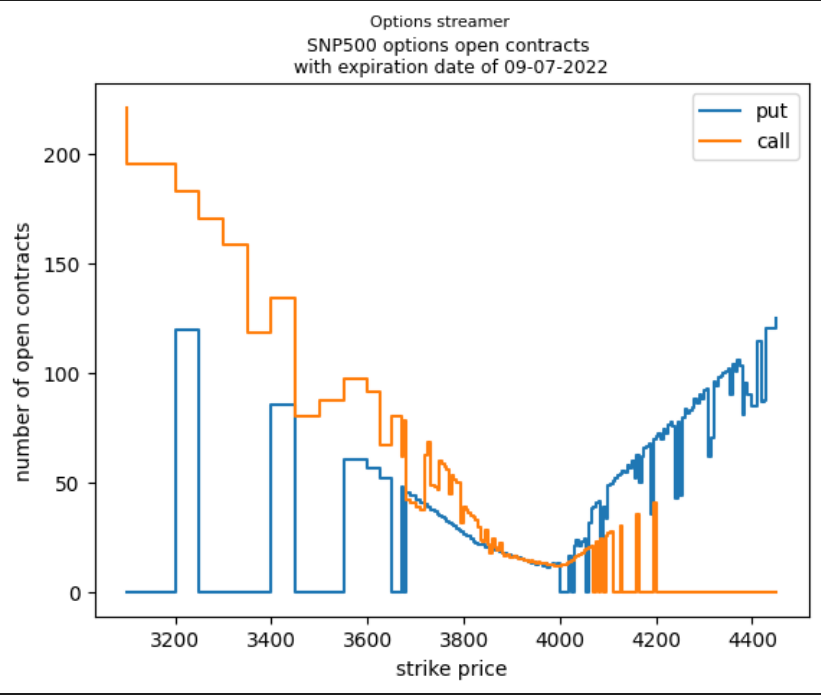

# Option Streamer

## Description
Download and view the latest open options contracts from barchart.com within a specified strike price range.

## Links
link of SNP500 option data in .cvs file format  
 https://www.barchart.com/stocks/quotes/$SPX/options?expiration=2022-08-19-m&moneyness=allRows  
 

## How to install on Linux
1. `python3 -m venv venv`
2. `source venv/bin/activate`
3. `pip install -r requiremetns`

## How to run
1. Download the options csv file from barchart.com with  
`python3 options_downloader.py`

2. Displays the open contracts in a given strike price range  
`python3 options_downloader.py` 
